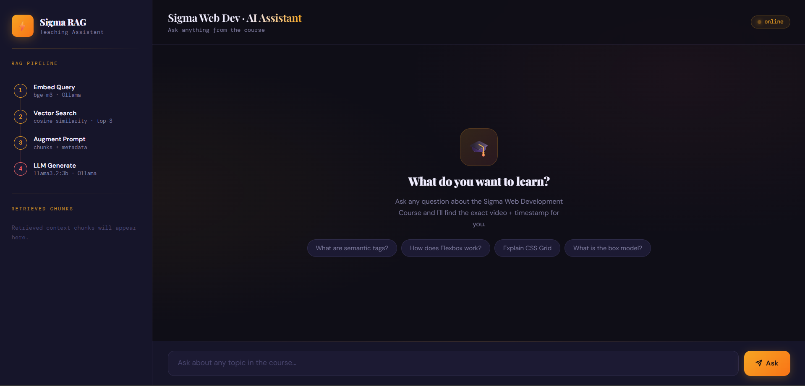
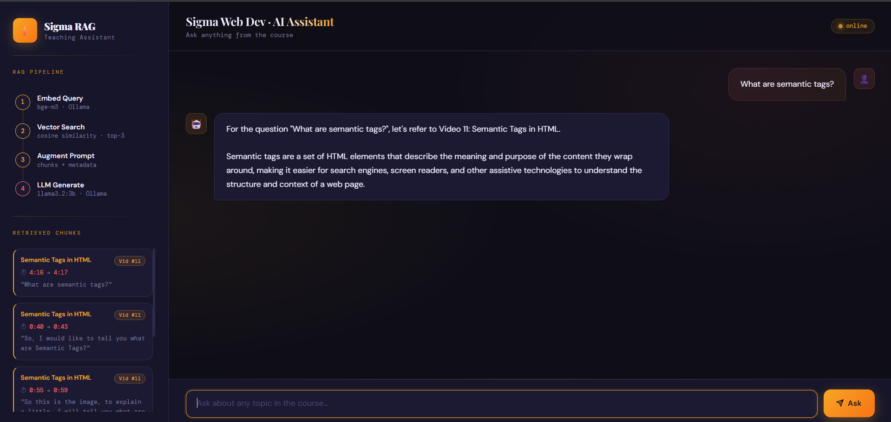
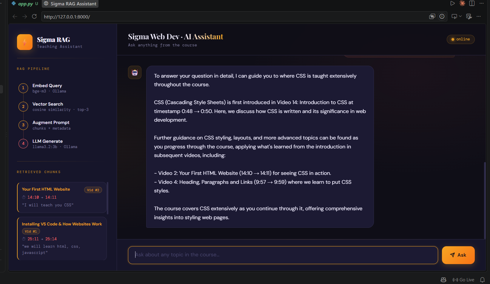

# 📚 Sigma RAG AI Teaching Assistant

An AI-powered **Retrieval-Augmented Generation (RAG)** application that answers questions from a course by retrieving the most relevant video transcript chunks and generating context-aware responses using a local LLM.

Instead of hallucinating answers, the assistant searches the course content, retrieves the correct timestamps, and generates answers grounded in the lecture transcripts.

---

## ✨ Features

- 🎥 Learn from your own course videos
- 🎙️ Automatic Video → Audio conversion
- 📝 Speech-to-Text transcription using Whisper
- ✂️ Transcript chunking with timestamps
- 🧠 Local embeddings using **bge-m3 (Ollama)**
- 🔍 Cosine Similarity Search
- 🤖 Response Generation using **Llama 3.2 (Ollama)**
- ⏱️ Returns exact video timestamps
- 📌 Displays retrieved context chunks
- 💻 Clean and modern Streamlit interface
- 🔒 Fully local pipeline (No OpenAI API required)

---

# 🛠️ Tech Stack

- Python
- Streamlit
- Whisper
- Ollama
- bge-m3 Embeddings
- Llama 3.2
- Pandas
- Joblib
- FFmpeg
- NumPy

---

# ⚙️ RAG Pipeline

```
Video
   │
   ▼
Extract Audio (FFmpeg)
   │
   ▼
Whisper Transcription
   │
   ▼
Timestamped JSON
   │
   ▼
Chunking
   │
   ▼
Embedding Generation (bge-m3)
   │
   ▼
Joblib Knowledge Base
   │
   ▼
User Query
   │
   ▼
Embedding
   │
   ▼
Cosine Similarity Search
   │
   ▼
Relevant Chunks
   │
   ▼
Prompt Augmentation
   │
   ▼
Llama 3.2
   │
   ▼
Final Answer
```

---

# 🚀 How to use this RAG AI Teaching Assistant on your own data

## Step 1 - Collect your videos

Move all your course/video files into the **video** folder.

---

## Step 2 - Convert videos into MP3

Run

```bash
video_to_mp3.py
```

This extracts audio from every video using FFmpeg.

---

## Step 3 - Convert MP3 into JSON

Run

```bash
mp3_to_json.py
```

Whisper converts every audio file into timestamped JSON transcripts.

---

## Step 4 - Generate Embeddings

Run

```bash
preprocess_json.py
```

This script

- Reads transcript JSON files
- Splits transcripts into chunks
- Generates embeddings using **bge-m3**
- Stores metadata
- Saves everything into a Joblib knowledge base

---

## Step 5 - Ask Questions

Run the application.

For every user query:

1. Generate query embedding
2. Search the Joblib vector database
3. Retrieve Top-K relevant chunks
4. Build an augmented prompt
5. Send prompt to Llama 3.2
6. Return grounded answer with timestamps

---

# 📂 Project Structure

```
RAG-AI-Teaching-Assistant
│
├── app.py
├── video_to_mp3.py
├── mp3_to_json.py
├── preprocess_json.py
├── videos/
├── mp3/
├── json/
├── embeddings/
├── screenshots/
├── requirements.txt
└── README.md
```

---

# 📷 Application Screenshots

# 📸 Screenshots

## Home Page

The landing page displays the complete RAG pipeline, chatbot interface, and suggested course-related questions for users to get started quickly.

<p align="center">
  
</p>

---

## Semantic Search & Timestamp Retrieval

When a user asks a question, the system retrieves the most relevant transcript chunks using semantic search and generates an accurate answer with the corresponding video timestamps.

<p align="center">
  
</p>

---

## Context-Aware Multi-Chunk Response

For broader questions, the assistant combines multiple relevant transcript chunks from different videos to generate a comprehensive and context-aware response while preserving timestamp references.

<p align="center">
  
</p>

---

## Out-of-Scope Query Handling

If a user asks a question outside the Sigma Web Development course, the assistant politely declines and informs the user that it can only answer questions related to the course content.

<p align="center">
  
</p>

---

# 💡 Example Query

```
What are semantic tags?
```

Output

- Relevant Video Number
- Timestamp
- Retrieved Transcript
- Context-aware Answer

---

# 📈 Future Improvements

- FAISS / ChromaDB Support
- Hybrid Search (BM25 + Embeddings)
- Multi-course Support
- PDF Knowledge Base
- YouTube URL Processing
- Conversation Memory
- Citation Highlighting
- Agentic RAG
- LangGraph Workflow
- Docker Deployment

---

# 👨‍💻 Author

**Vinay Choudhary**

GitHub: https://github.com/Vinay3606

LinkedIn: https://www.linkedin.com/in/vinay-choudhary-3a6286288
